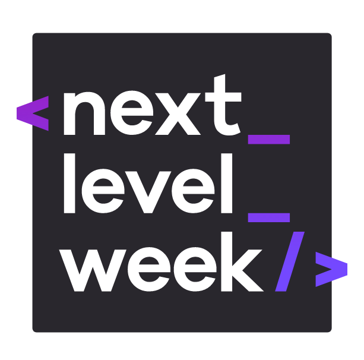
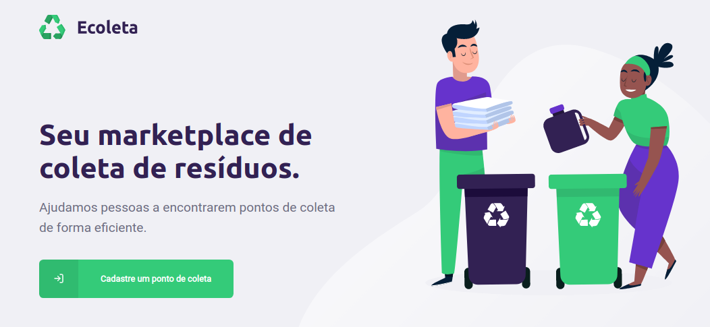

<!--
*** Thanks for checking out this README Template. If you have a suggestion that would
*** make this better, please fork the Ecoleta-Typescript-Node-React-ReactNative-SQlite and create a pull request or simply open
*** an issue with the tag "enhancement".
*** Thanks again! Now go create something AMAZING! :D
***
***
***
*** To avoid retyping too much info. Do a search and replace for the following:
*** conradoalexsander, Ecoleta-Typescript-Node-React-ReactNative-SQlite, twitter_handle, email
-->

<!-- PROJECT SHIELDS -->
<!--
*** I'm using markdown "reference style" links for readability.
*** Reference links are enclosed in brackets [ ] instead of parentheses ( ).
*** See the bottom of this document for the declaration of the reference variables
*** for contributors-url, forks-url, etc. This is an optional, concise syntax you may use.
*** https://www.markdownguide.org/basic-syntax/#reference-style-links
-->
[![Contributors][contributors-shield]][contributors-url]
[![Forks][forks-shield]][forks-url]
[![Stargazers][stars-shield]][stars-url]
[![Issues][issues-shield]][issues-url]
[![MIT License][license-shield]][license-url]
[![LinkedIn][linkedin-shield]][linkedin-url]


<!-- PROJECT LOGO -->
<br />
<p align="center">
  <a href="https://github.com/conradoalexsander/Ecoleta-Typescript-Node-React-ReactNative-SQlite">
    
  </a>

  <h1 align="center">Ecoleta</h1>

  <h2 align="center">
    Find the best spots to deliver recyclable material
  </h2>
    <br />
 
</p>

<!-- ABOUT THE PROJECT -->
## :mortar_board: About The Project

<p align="center">

</p>

Project developed during the Next Level Week, an event organized by <a href="https://rocketseat.com.br/">Rocketseat</a> focused in the Typescript (and Javascript) Stack: React, React Native and Node. During seven days, participants are pushed to the limit, to deliver this full stack application.


<!-- TABLE OF CONTENTS -->
## :bookmark: Table of Contents

* [About the Project](#about-the-project)
  * [Built With](#:rocket:-built-with)
* [Getting Started](#getting-started)
  * [Prerequisites](#prerequisites)
  * [Installation](#installation)
* [Usage](#usage)
* [License](#license)
* [Contact](#contact)
* [Acknowledgements](#acknowledgements)


<!-- BUILT WITH -->
## :rocket: Built With

### Web app
* []() React
* []() Axios
* []() Leaflet (maps)
* []() Typescript

### Mobile app
* []() React Native
* []() Axios
* []() Expo
* []() Typescript

### Backend app
* []() Ts-Node
* []() Express
* []() KnexJs
* []() SQLite

<!-- GETTING STARTED -->
## :fire: Getting Started

Before following the next steps, make sure to change the routes with the correctlye connection (for expo check the 192.XXX.XXX:YYYY connection).

1. Open the server folder in a terminal and execute the following command:
```sh
npm run dev
```
2. Open the web folder in a terminal and execute the following command:
```sh
npm start
```
or

```sh
yarn start
```
You will be able to create new points from the web page now.

3. Open the mobile folder in a terminal and execute the following command:
```sh
expo start
```

4. Use the expo app in your celphone to connect the app on it. Your pc and mobile device must be in the same network:

You can now check the points, its location and filter them by recycable item.

### Prerequisites

* []() Node
* []() Expo

### Installation
 
1. Clone the Ecoleta-Typescript-Node-React-ReactNative-SQlite
```sh
git clone https://github.com/conradoalexsander/Ecoleta-Typescript-Node-React-ReactNative-SQlite.git
```
2. Install NPM packages (run this command in web, server and mobile folders)
```sh
npm install
```
<!-- USAGE EXAMPLES -->
## Usage

<p align="center" float="left">
  
   

</p>


<!-- LICENSE -->
## License

Distributed under the MIT License.


<!-- CONTACT -->
## Contact

Conrado Alexsander </br>
Github: [https://github.com/conradoalexsander](https://github.com/conradoalexsander) </br>
Project Link: [https://github.com/conradoalexsander/Ecoleta-Typescript-Node-React-ReactNative-SQlite](https://github.com/conradoalexsander/Ecoleta-Typescript-Node-React-ReactNative-SQlite)


<!-- ACKNOWLEDGEMENTS -->
## Acknowledgements

* []() <a href="https://rocketseat.com.br/">Rocketseat</a>


<!-- MARKDOWN LINKS & IMAGES -->
<!-- https://www.markdownguide.org/basic-syntax/#reference-style-links -->
[contributors-shield]: https://img.shields.io/github/contributors/conradoalexsander/Ecoleta-Typescript-Node-React-ReactNative-SQlite.svg?style=flat-square
[contributors-url]: https://github.com/conradoalexsander/Ecoleta-Typescript-Node-React-ReactNative-SQlite/graphs/contributors

[forks-shield]:  https://img.shields.io/github/forks/conradoalexsander/Ecoleta-Typescript-Node-React-ReactNative-SQlite.svg?style=flat-square

[forks-url]: https://github.com/conradoalexsander/Ecoleta-Typescript-Node-React-ReactNative-SQlite/network/members

[stars-shield]: https://img.shields.io/github/stars/conradoalexsander/Ecoleta-Typescript-Node-React-ReactNative-SQlite.svg?style=flat-square
[stars-url]: https://github.com/conradoalexsander/Ecoleta-Typescript-Node-React-ReactNative-SQlite/stargazers
[issues-shield]: https://img.shields.io/github/issues/conradoalexsander/Ecoleta-Typescript-Node-React-ReactNative-SQlite.svg?style=flat-square
[issues-url]: https://github.com/conradoalexsander/Ecoleta-Typescript-Node-React-ReactNative-SQlite/issues
[license-shield]: https://img.shields.io/github/license/conradoalexsander/Ecoleta-Typescript-Node-React-ReactNative-SQlite.svg?style=flat-square
[license-url]: https://github.com/conradoalexsander/Ecoleta-Typescript-Node-React-ReactNative-SQlite/blob/master/LICENSE.txt
[linkedin-shield]: https://img.shields.io/badge/-LinkedIn-black.svg?style=flat-square&logo=linkedin&colorB=555
[linkedin-url]: https://linkedin.com/in/conradoalexsander
[product-screenshot]: images/screenshot.png
